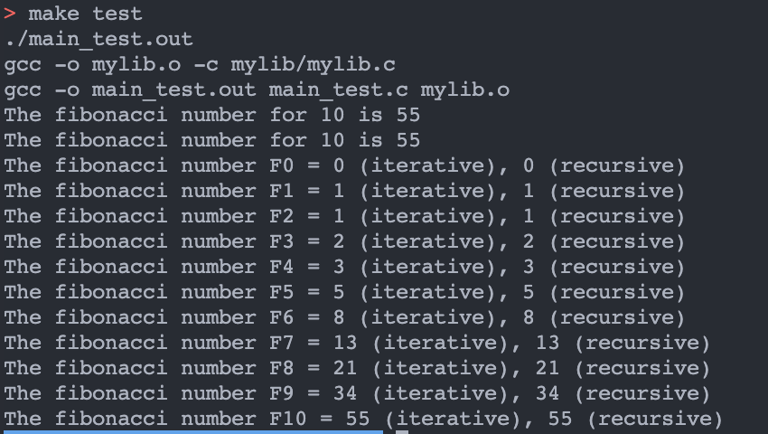
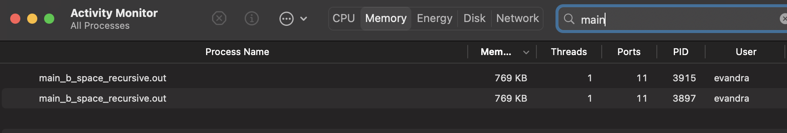

# Fibonacci Benchmark
- Fibonacci sequence is the series of numbers where the next number is found by adding up the two numbers before it.

### 2 ways of doing Fibonacci Sequence
- Iterative
```c
int iterativeFibonacci(int num){

    int num1 = 0;
    int num2 = 1;
    int output;

    if (num == 0){
        return num1;
    } else if (num == 1){
        return num2;
    } else{
        for(int i = 2; i <= num; i++){
            output = num1 + num2;
            num1 = num2;
            num2 = output;
        }
        return output;
    }
    
    
}
```

- Recursive
```c
int recursiveFibonacci(int num){

    if (num == 0){
        return 0;
    } else if (num == 1){
        return 1;
    } else{
        return recursiveFibonacci(num-1)+recursiveFibonacci(num-2);
    }
    
}
```

### Benchmark

The main purpose of this benchmark between Iterative and Recursive is to test the time and the space complexity of both ways and check which is the fastest.

### Run the code
In order to run the program, the following commands must be execute.
```bash
make: ./main_test.out
```

### Result


### Time Complexity
The following test is to check the time complexity of both ways to find the fibonacci with the same number(N) which is 10

- Iterative
```bash
make time-iterative
./main_b_time_iterative.out
```
```c
int main (void) {

    srand(time(0));
    int a;

    const int N = 35;

    float startTime = (float)clock()/CLOCKS_PER_SEC;
    for (int i = 0; i < N; i++){
        a = iterativeFibonacci(i);
    }
    float endTime  = (float)clock()/CLOCKS_PER_SEC;

    printf("Time elapsed: %f s\n",endTime - startTime);

    return 0;
}
```
#### Output :


- Recursive
```bash
make time-recursive
./main_b_time_recursive.out
```
```c
int main (void) {

    srand(time(0));
    int a;

    const int N = 35;

    float startTime = (float)clock()/CLOCKS_PER_SEC;
    for (int i = 0; i < N; i++){
        a = recursiveFibonacci(i);
    }
    float endTime  = (float)clock()/CLOCKS_PER_SEC;

    printf("Time elapsed: %f s\n",endTime - startTime);

    return 0;
}
```

#### Output :


### Space Complexity
The main purpose of this benchmark between Iterative and Recursive is to test the time and the space complexity of both ways and check which is the fastest. In this space comlexity, we test the amount of memory space required to execute the program.

- Iterative
```c
int main (void) {

    int a;

    while (1) {
        a = iterativeFibonacci(2000);
        }

    return 0;

}
```

- Recursive
```c
int main (void) {

    int a;

    while (1) {
        a = recursiveFibonacci(2000);
        }

    return 0;

}
```

#### Output :


## Conclusion :

In conclusion, with the comparison available such as time complexity and space complexity. we can compare which ways of doing the Fibonacci Sequance faster and effective for the user to use. from both ways, we can conclude that iterative method has lower time complexity and space complexity compare to the recursive method. therefore, iterative method is more effective compare to the recursive method. 